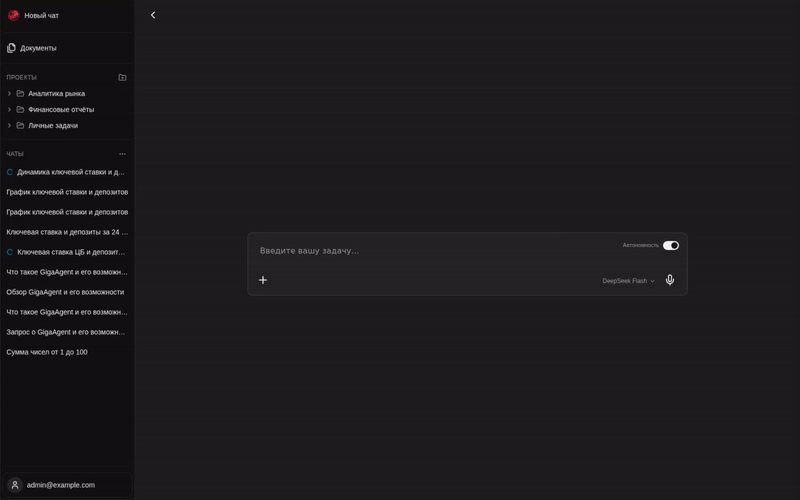

<h1 align="center">Универсальный AI-агент</h1>

<picture>
  <source media="(prefers-color-scheme: light)" srcset="https://github.com/ai-forever/giga_agent/blob/v0.1/docs/images/giga-agent_light_logo.png">
  <source media="(prefers-color-scheme: dark)" srcset="https://github.com/ai-forever/giga_agent/blob/v0.1/docs/images/giga-agent_dark_logo.png">
  
</picture>

[ [Русский](https://www.zdoc.app/ru/ai-forever/giga_agent) | 
[中文](https://www.zdoc.app/zh/ai-forever/giga_agent) | 
[English](https://www.zdoc.app/en/ai-forever/giga_agent) | 
[Español](https://www.zdoc.app/es/ai-forever/giga_agent) ]
**GigaAgent может решать самые разные задачи, используя более 30 встроенных инструментов и субагентов.**

Например, он позволит вам работать с большими файлами через код (Excel-файл с десятками тысяч строк), [придумать мем](docs/examples/memes/chat.pdf), [описать бизнес-модель стартапа](docs/examples/lean_canvas/lean_canvas.pdf) или [создать лендинг](docs/examples/changelog_landing/changelog_landing.pdf).
Для этого GigaAgent использует субагентов, REPL-среду для исполнения кода и сторонние сервисы.

GigaAgent разработан в рамках проекта [GigaChain](https://github.com/ai-forever/gigachain) – открытого набора инструментов для разработки LLM-приложений и мультиагентных систем.

GigaAgent умеет:

- работать с разными моделями, [доступными в LangChain](https://python.langchain.com/docs/integrations/chat/#all-chat-models): GigaChat, ChatGPT, Anthropic и другими
- исполнять код в чате с помощью в REPL-среды, подобной [блокнотам Jupyter](https://jupyter.org/)
- обмениваться данными со сторонними сервисами: VK, GitHub, 2GIS и другими
- использовать инструменты для анализа данных, генерации изображений, создания презентаций и лендингов
- генерировать изображения с помощью разных провайдеров: GigaChat, FusionBrain, OpenAI;
- работать локально или в облаке, с помощью Docker
- использовать ваши MCP-тулы
- применять знания из ваших документов с помощью RAG

## Демо



Примеры работы с GigaAgent в формате PDF:

- [кластеризация комментариев в VK](docs/examples/cluster_comments/clusters_ru.pdf)
- [анализ настроений комментариев в VK и вывод основных жалоб](docs/examples/sentiment_analysis/sentiment_analysis.pdf)
- [создание сайта со списком изменений, созданным на основе последних закрытых PR](docs/examples/changelog_landing/changelog_landing.pdf)

Примеры работы субагентов, а также подробная информация о них — в разделе [Субагенты](SUBAGENTS.md).
Описание доступных инструментов и процесса создания новых инструментов можно найти в разделе [Инструменты в GigaAgent](TOOLS.md)

## Содержание

- [Быстрый старт](#быстрый-старт)
- [Функциональные возможности](#функциональные-возможности)
- [Конфигурация](#конфигурация)
- [Запуск через Docker](#запуск-через-docker)
- [Технологический стек](#технологический-стек)
- [Архитектура](#архитектура)
- [Структура проекта](#структура-проекта)
- [Troubleshooting](#troubleshooting)
- [Для разработчиков](#для-разработчиков)
- [Дополнительные материалы](#дополнительные-материалы)
- [Contributing](#contributing)
- [License](#license)

## Быстрый старт

1. Установите пакет:
  ```bash
   pip install giga_agent
  ```
2. Запустите dev-сервер:
  ```bash
   giga_agent run dev
  ```
3. Откройте в браузере:
  ```text
   http://localhost:9090
  ```

Логин по умолчанию при первой инициализации (когда в БД нет пользователей):

- `admin@example.com`
- `giga_agent_admin`

Для начала работы с агентом настройте следующие интеграции в настройках пользователя:
- Коннекторы (используются в LLM / Embeddings)
- LLM
- Embeddings
- Sandbox

## Функциональные возможности

### 💬 Chat & Agent System

- **Streaming Chat** — диалог с AI-агентом
- **Thread Management** — история диалогов
- **Message Branching** — ветвление диалогов для экспериментов
- **File Attachments** — поддержка изображений, документов, аудио, видео
- **Tool Visualization** — визуализация выполнения инструментов в UI
- **Auto-approve Mode** — автоматическое подтверждение использования инструментов

### 🔧 Встроенные модули

GigaAgent включает **13 готовых модулей** для разных задач:


| Модуль             | ID                 | Описание                                                                         |
| ------------------ | ------------------ | -------------------------------------------------------------------------------- |
| **Auth**           | `auth`             | Аутентификация, управление пользователями и группами                             |
| **REPL**           | `repl`             | Выполнение Python и shell команд в sandbox                                       |
| **Image**          | `image`            | Генерация изображений (GigaChat, FusionBrain, OpenAI)                            |
| **Analyze Images** | `analyze_images`   | Анализ изображений через multimodal LLM                                          |
| **Search**         | `search`           | Веб-поиск через                                                         |
| **Scraper**        | `scraper`          | Извлечение контента с веб-страниц (Jina AI Reader)                               |
| **RAG**            | `rag`              | Retrieval Augmented Generation с векторным поиском                               |
| **GitHub**         | `github`           | Интеграция с GitHub API                                                          |
| **VK**             | `vk`               | Интеграция с VK API                                                              |
| **Weather**        | `weather`          | Получение прогноза погоды                                                        |
| **Mem0**           | `mem_zero_memory`  | Долговременная память агента                                                     |
| **Subagents**      | `subagents_legacy` | Специализированные субагенты (landing, presentation, meme, podcast, lean_canvas) |
| **MCP**            | `frontend_mcp`     | Вызов MCP-тулов на стороне фронтенда пользователя                                                |


### 🐳 Sandbox Providers

Изолированные окружения для безопасного выполнения кода:

#### Local Docker

- **Описание:** Контейнеры на локальной машине или VPS
- **Использование:** Локальная разработка и self-hosted deployment
- **Настройка:**
  - Образ: `mikelarg/code-interpreter:0.0.5`
  - Resource limits (CPU, memory, PIDs)
  - Доступ: только superuser
- **Преимущества:** Полный контроль, без внешних зависимостей
- **Недостатки:** Требует Docker daemon на хосте

#### E2B Cloud

- **Описание:** Облачные sandboxes от [e2b.dev](https://e2b.dev/)
- **Использование:** Production-ready решение без инфраструктуры
- **Настройка:** Требуется API ключ E2B
- **Преимущества:** Автомасштабирование, управляемая инфраструктура
- **Недостатки:** Зависимость от внешнего сервиса

### 🤖 Субагенты (Legacy)

Специализированные агенты для прикладных задач:


| Субагент         | Описание                        | Graph ID       |
| ---------------- | ------------------------------- | -------------- |
| **Landing**      | Генерация лендинговых страниц   | `landing`      |
| **Presentation** | Создание презентаций            | `presentation` |
| **Meme**         | Генерация мемов с изображениями | `meme`         |
| **Podcast**      | Создание подкастов из текста    | `podcast`      |
| **Lean Canvas**  | Описание бизнес-модели стартапа | `lean_canvas`  |


См. [SUBAGENTS.md](SUBAGENTS.md) для подробностей.

### 📚 RAG (Retrieval Augmented Generation)

- **Document Collections** — организация знаний по коллекциям
- **Multiple Formats** — поддержка PDF, DOCX, TXT, Markdown, HTML
- **Vector Search** — семантический поиск через Qdrant
- **Permissions** — настройка доступа к коллекциям

### 🔐 Управление доступом

- **User Management** — создание и управление пользователями
- **Groups** — объединение пользователей в группы
- **Resource Permissions (ACL)** — детальный контроль доступа к ресурсам:
  - Read access — просмотр
  - Owner — полный контроль
- **JWT Tokens** — безопасная аутентификация через cookie или Bearer header
- **Superuser Role** — административные привилегии (local docker, admin panel)

### 🔌 Интеграции

**LLM Providers:**

- OpenAI (GPT-4, GPT-3.5)
- GigaChat
- Anthropic (Claude)
- Любые модели через LangChain

**Embedding Models:**

- OpenAI Embeddings
- GigaChat Embeddings

**External Services:**

- Tavily — веб-поиск
- Jina AI — web scraping
- GitHub API — работа с репозиториями
- VK API — социальная сеть

**Vector Store:**

- Qdrant — для RAG и Mem0

### 🧪 REPL Environment

Выполнение кода прямо в чате:

- **Python REPL** — полноценный Python interpreter
- **Shell Commands** — выполнение bash команд
- **File Operations** — работа с файлами внутри sandbox
- **Nested Tool Calls** — LLM tools доступны из Python кода
- **Persistent Context** — сохранение переменных между вызовами

### 🎨 Генерация изображений

Поддержка множественных провайдеров:

- GigaChat (Kandinsky)
- FusionBrain (Kandinsky)
- OpenAI (DALL-E)

## Конфигурация

### Минимум для старта

Для локального `giga_agent run dev` дополнительная конфигурация может не требоваться.
Если нужны предсказуемые значения в окружении, задайте:

```bash
export GIGA_AGENT_SECRET_KEY="replace_with_secure_value"
export GIGA_AGENT_ADMIN_EMAIL="admin@your-domain.com"
export GIGA_AGENT_ADMIN_PASSWORD="your_strong_password"
```

Поведение admin-инициализации:

- если пользователей нет, создается первый admin из `GIGA_AGENT_ADMIN_EMAIL` / `GIGA_AGENT_ADMIN_PASSWORD`;
- если пользователи уже есть, авто-создание admin пропускается.

### Advanced env (runtime/integration)

В расширенной конфигурации обычно настраиваются:

- sandbox/runtime параметры;
- docker-ориентированные env;
- БД/кэш/векторное хранилище;
- tracing/observability параметры.

Детальный env-референс: [docs/configuration/env.md](docs/configuration/env.md)

## Запуск через Docker

Docker-сценарий оставляем как второй quick start (для self-hosted/операционного запуска).

### Отличие от `pip + run dev`

- `pip + run dev`: самый быстрый локальный запуск для разработки и проверки.
- `docker compose`: более инфраструктурный сценарий с отдельными сервисами (nginx/postgres/redis/qdrant и т.д.).

### Быстрые шаги

1. Подготовьте `.env`:
  ```bash
   cp .env.example .env
  ```
   Минимально проверьте/заполните:
  - `GIGA_AGENT_SECRET_KEY`
  - `GIGA_AGENT_HOST_PROJECT_PATH` (абсолютный путь до репозитория на хосте; важен для local docker sandbox)
2. (Опционально) скачайте image для code interpreter:
  ```bash
   docker image pull mikelarg/code-interpreter:0.0.5
  ```
3. Соберите и поднимите сервисы:
  ```bash
   make build
   make up
  ```
4. Откройте UI:
  ```text
   http://localhost:8123
  ```

### Перезапуск после обновления репозитория

```bash
make down
make build
make up
```

Для dev-варианта compose:

```bash
make build_dev
make up_dev
```

## Технологический стек

### Backend

- **Python 3.11+** — современный Python с async/await
- **[LangGraph 1.0.8](https://github.com/langchain-ai/langgraph)** — state machine для AI-агентов от LangChain
- **[FastAPI](https://fastapi.tiangolo.com/)** — высокопроизводительный веб-фреймворк
- **[SQLAlchemy 2.0](https://www.sqlalchemy.org/)** — async ORM с поддержкой SQLite и PostgreSQL
- **[Alembic](https://alembic.sqlalchemy.org/)** — система миграций с multi-scope поддержкой
- **Redis** — кэширование и distributed locks (через [cashews](https://github.com/Krukov/cashews))
- **[Qdrant](https://qdrant.tech/)** — векторное хранилище для RAG и Mem0
- **[E2B](https://e2b.dev/)** — облачные sandboxes для безопасного выполнения кода
- **Docker SDK** — управление локальными sandbox-контейнерами

### Frontend

- **[React 19](https://react.dev/)** — последняя версия React
- **[TypeScript 5.8](https://www.typescriptlang.org/)** — статическая типизация
- **[Vite 7](https://vitejs.dev/)** — быстрая сборка и dev-сервер
- **[Tailwind CSS 4](https://tailwindcss.com/)** — utility-first CSS фреймворк
- **[Radix UI](https://www.radix-ui.com/)** — headless UI компоненты
- **[LangGraph SDK](https://github.com/langchain-ai/langgraph/tree/main/libs/sdk-js)** — интеграция с LangGraph для streaming
- **[Framer Motion](https://www.framer.com/motion/)** — анимации

### Инфраструктура

- **Docker & Docker Compose** — контейнеризация
- **Nginx** — reverse proxy для production
- **PostgreSQL** — production база данных (dual-database: LangGraph + app)
- **SQLite** — development база данных

## Архитектура

### Ключевые принципы

#### 1. Модульная система

Каждый модуль (`BaseModule`) — независимый plugin:

- **Собственные миграции** — таблицы с auto-префиксом модуля
- **Независимые инструменты** — tools для агента
- **Собственные API endpoints** — автоматический роутинг
- **Инструкции и middleware** — настройка поведения агента

#### 2. Dual-Database Strategy

**Development (local):**

- SQLite с `aiosqlite` драйвером
- Файловая БД в `.giga_agent/`
- Batch-режим для миграций

**Production (docker):**

- Две отдельные PostgreSQL базы:
  1. **LangGraph DB** — state checkpoints, thread history
  2. **Application DB** — метаданные, пользователи, конфигурация (asyncpg)

#### 3. Registry Pattern

Runtime компоненты регистрируются динамически:

- **Connectors** — подключения к внешним сервисам (OpenAI, GigaChat, Tavily)
- **LLMs** — языковые модели с валидацией настроек
- **Embeddings** — модели векторизации
- **Sandbox Providers** — окружения выполнения кода
- **Image Generators** — генераторы изображений
- **Search Engines** — поисковые движки

#### 4. Sandbox Execution

Безопасное выполнение Python-кода/Shell комманд в изолированных окружениях:

**Local Docker:**

- Контейнеры на локальной машине или VPS
- Resource limits (CPU, memory, PIDs)
- Volume mounts для файлов
- Только для superuser (security)

**E2B Cloud:**

- Облачные sandboxes (e2b.dev)
- Автомасштабирование
- API-based управление

#### 5. Background Tasks

Фоновые процессы с Redis-координацией для multi-instance deployment:

- **Idle Sweeper** — останавливает неактивные sandboxes
- **Orphan Sweeper** — удаляет "осиротевшие" ресурсы

#### 6. Security & ACL

- **JWT Authentication** — cookie + Bearer token
- **Resource-level permissions** — read/edit/owner access
- **Group-based access control** — разделение доступа по группам
- **bcrypt** — хеширование паролей

## Troubleshooting

- UI не открывается:
  - проверьте, что dev-сервер запущен на `localhost:9090` (pip режим) или что `make up` поднял nginx на `8123` (docker режим).
- Не удается залогиниться:
  - если это первый запуск, используйте дефолтные креды или проверьте `GIGA_AGENT_ADMIN_EMAIL` / `GIGA_AGENT_ADMIN_PASSWORD`;
- Не видны провайдеры/инструменты:
  - проверьте env-конфиг и настройки в UI (`/settings/`*).

## Для разработчиков

Ключевые CLI-команды:

- Проверка состояния миграций:
  ```bash
  giga_agent check
  ```
- Применение миграций:
  ```bash
  giga_agent migrate
  ```
- Генерация миграций:
  ```bash
  giga_agent makemigrations
  ```
- Проксирование Alembic-команд:
  ```bash
  giga_agent alembic --scope core upgrade head
  ```
- Экспорт langgraph-конфига:
  ```bash
  giga_agent export-langgraph-json
  ```

## Дополнительные материалы

- Субагенты: [SUBAGENTS.md](SUBAGENTS.md)
- Инструменты: [TOOLS.md](TOOLS.md)
- Observability для локального запуска: [docs/configuration/observability-local.md](docs/configuration/observability-local.md)

## Contributing

PR и issue приветствуются. Для больших изменений лучше заранее описать proposal в issue с ожидаемым эффектом и планом валидации.

## License

Проект распространяется под лицензией MIT. См. файл [LICENSE](LICENSE).